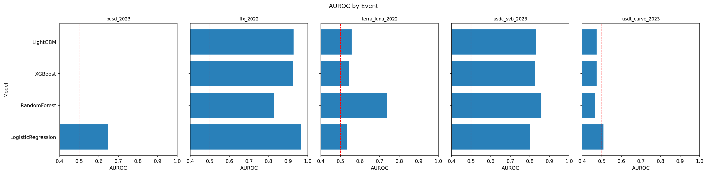
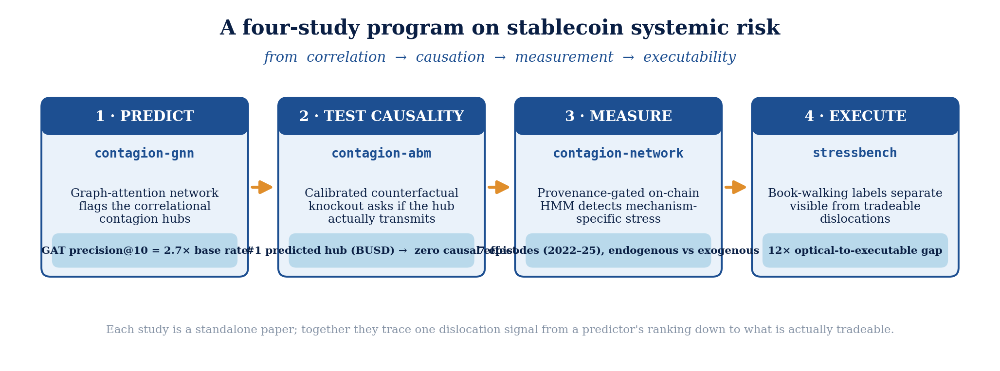
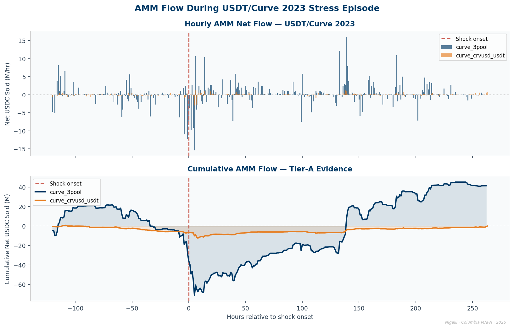
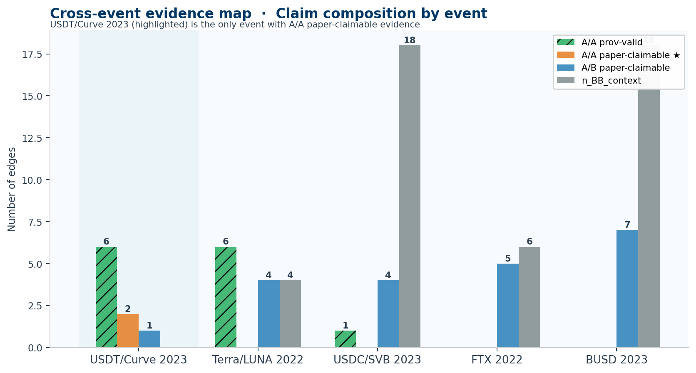
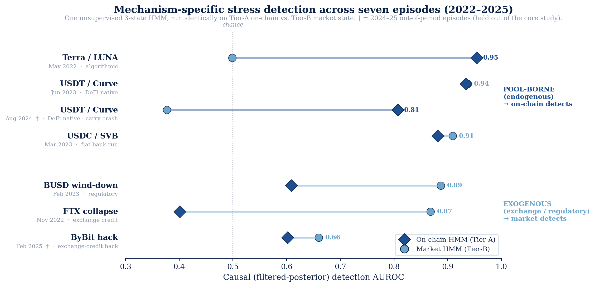

# Provenance-Aware Stablecoin Stress Propagation Networks

[](https://github.com/nl2992/ICAIF_stablecoin-contagion-network/actions/workflows/ci.yml) [](LICENSE) [](environment.yml)

<p align="center">
  
</p>

<p align="center"><em>Online detection AUROC by event and evidence layer: on-chain Tier-A flow recovers endogenous DeFi-native stress that the market layer registers at chance.</em></p>

Evidence from Curve TokenExchange logs, public CEX data, and on-chain settlement flows.

---

This repository builds a provenance-aware empirical framework for studying how stablecoin
stress propagates across public CEX markets, on-chain AMM pools, and settlement-flow channels.
The core contribution is not merely a directed network of correlations; it is a claim-gated
pipeline that restricts every empirical claim by both **data provenance** and **statistical
support**.

The strongest current evidence layer is **Tier-A on-chain AMM flow** from Curve
`TokenExchange` logs and Uniswap v3 `Swap` logs. Public CEX prices, BBO, and trade/candle
data provide broader market context but are capped at Tier B because **historical full-depth CEX order books are not freely available**.

---

## Part of a coordinated four-study program

These four repositories trace one stablecoin-dislocation signal end-to-end — from a predictor's hub ranking down to what is actually tradeable. **This repo is study 3 (MEASURE).**

<p align="center"></p>

*From correlation (GNN) → causation (ABM) → measurement (provenance-gated on-chain HMM) → executability (12× optical gap). Generated by `scripts/make_research_arc_figure.py`.*

---

## Research question

> **How does stablecoin stress propagate across venues, liquidity pools, and settlement channels once a shock begins?**

We treat stablecoin stress as both a price event and a flow event. During stress, users trade
on centralized venues, swap through AMMs, redeem or mint stablecoins, and move liquidity across
settlement channels. The repo constructs a multi-layer network from these channels and gates
each edge by the quality of its underlying evidence.

---

## Core thesis

Stablecoin de-pegs are not only price deviations; they are **observable liquidity-flow events**.
The cleanest freely reproducible Tier-A evidence comes from on-chain AMM flow logs, especially
Curve `TokenExchange` events and Uniswap v3 `Swap` events. Public CEX data are useful for
timing and context, but they cannot support historical order-book microstructure claims
without vendor or live-captured L2.

Accordingly, this project separates:

- **Tier-A AMM / on-chain flow evidence**: direct logs such as Curve `TokenExchange`,
  Uniswap v3 `Swap`, and mint/burn events.
- **Tier-B public market context**: Binance/Coinbase/Kraken OHLCV, trades, BBO, and aggregate
  flows.
- **Fixture/diagnostic outputs**: synthetic data used only for pipeline testing; blocked from
  all paper claims.

---

## How a claim is gated

The strongest evidence layer is Tier-A on-chain AMM flow from Curve `TokenExchange`
logs and Uniswap v3 `Swap` logs. Before any edge becomes a paper claim it must clear
two independent gates:

> **Terminology**
>
> - **Provenance-valid**: both endpoints and the feature used by the edge are sufficiently high
>   quality (no fixture, no missing tier, feature-level cap applied).
> - **Statistically supported**: the relevant method passes its significance criterion (FDR,
>   block-shuffle, Bonferroni, or Granger p-values).
> - **Paper-claimable** (`paper_claim_allowed == True`): **both** gates pass.

A/A provenance-valid candidate pairs exist in 3 of 5 events.
**Provenance-valid ≠ paper-claimable.** Only pairs that also pass the statistical gate support
directional paper claims.

| Pair | Event | Evidence type | Paper-claimable? |
|---|---|---|---|
| `curve_3pool` ↔ `curve_crvusd_usdt` | USDT/Curve 2023 | A/A Curve DEX-flow | **Yes** (Bonferroni p ≤ 0.036) |
| Curve pools ↔ `uniswap_usdc_usdt_005` | USDT/Curve 2023 | A/A cross-protocol DEX-flow | **Yes** (Bonferroni p < 0.001 for cross-protocol rows) |
| `curve_3pool` ↔ `curve_ust_wormhole` | Terra/LUNA 2022 | A/A DEX-flow | No (not sig. at hourly grid) |
| `usdc_mint_burn` ↔ `curve_3pool` | USDC/SVB 2023 | A/A on-chain settlement | No (sparse; 4 events, underpowered) |

For FTX 2022 and BUSD 2023, A/B directional evidence is available (`curve_3pool` A +
Binance/CoinMetrics B nodes). The full headline table is
`results/paper/tables/table_aa_paper_claimable_edges.csv`; the Curve–Uniswap cross-protocol
extension is `table_cross_protocol_leadlag_usdt_curve_2023.csv`; the complete verified
data inventory is `DATA_INVENTORY.md`. The findings these pairs support are summarized next.

---

## Empirical results

The paper rests on four findings across the five stress episodes, each gated by data
provenance (Tier-A on-chain evidence separated from Tier-B market context) and split
sharply by **shock mechanism** — endogenous (AMM pool-imbalance) versus exogenous
(algorithmic, bank-run, exchange-credit, regulatory).

1. **Regime-switching coupling.** For the endogenous USDT/Curve 2023 episode, cross-pool
   flow coupling rises from near-zero in calm (ρ̂ = 0.09) to ρ̂ = 0.53 in the acute window
   (Fisher *z* = 2.82, block-bootstrap one-sided *p* = 0.035). None of the four exogenous
   episodes activates, despite each carrying a genuine Tier-A A/A pool pair — so the null is
   mechanism-specific, not a data gap.
2. **Arbitrage flips** from stabilizing to amplifying under endogenous stress
   (*z* = +3.84 USDT/Curve, +3.69 BUSD, −2.80 FTX).
3. **On-chain price discovery.** The Curve pool leads the exchange for DeFi-native stress
   (deviating 37× more than Binance) and lags only for the exogenous SVB bank run.
4. **Complementary detection.** An unsupervised online HMM on on-chain state reaches
   AUROC 0.95 on Terra/LUNA (vs 0.50 on market data), 116 h earlier; supervised cross-event
   prediction fails under concept shift (*r* = 0.525, *p* = 0.017) — where labels are scarce,
   *detect* rather than *predict*.

A multi-method convergence check (Forbes–Rigobon lead-lag, transfer entropy, TVP-VAR) agrees
that the USDT/Curve coupling is **contemporaneous common-factor co-movement, not directional
contagion**. Full tables under `results/paper/tables/`; the headline A/A edge table is
`table_aa_paper_claimable_edges.csv`.

<details>
<summary>Per-event A/A lead-lag detail (all five episodes, real data)</summary>

### Node coverage (real data, Tier verified)

| Node | Tier | Hourly rows | Source |
|---|---|---|---|
| `curve_3pool` | **A** | 379 | Etherscan `TokenExchange` logs (4,175 events) |
| `curve_crvusd_usdt` | **A** | 285 | Etherscan `TokenExchange` logs (1,061 events) |
| `usdt_mint_burn` | **A** | 5 | Etherscan `Issue`/`Redeem` logs (Tether decoder) |
| `eth_usdt_exchange_flows` | B | 355 | Etherscan tokentx, exchange-labelled |
| `usdt_binance` | B | 23,040 | Binance Vision bookTicker/klines |

> The `usdt_mint_burn` node is **now genuine Tier-A** (5 hourly Issue/Redeem
> events) — previously fixture. This is the first run with the Tether
> Issue/Redeem decoder live.

### Headline result — CONFIRMED

The primary A/A lead-lag result reproduces exactly on fresh real data:

| Direction | Lag | ρ̂ | p (raw) | p (Bonf.) | Sig. |
|---|---|---|---|---|---|
| `curve_3pool` → `curve_crvusd_usdt` | 0 | **0.3857** | 0.007 | **0.014** | ✓ |
| `curve_crvusd_usdt` → `curve_3pool` | 0 | **0.3857** | <0.001 | **<0.001** | ✓ |

- Feature: `usdc_net_sold_1h`; grid: 3600 s; overlap **n = 281 non-null hourly
  buckets**.
- Claim gate: `claim_level = A_A_dex_flow`, `claim_strength = robust`,
  `paper_claim_allowed = True` (both directions), `uses_fixture = false`.
- 4 of 45 provenance-claimable rows pass the paper gate (100% provenance pass).

</details>

---

## Data provenance and feature-tiering

The repo uses both **node-level** and **feature-level** provenance. A node can be Tier A while
some of its derived features are Tier B.

| Feature | Tier | Evidence type |
|---|---|---|
| `usdc_net_sold_1h` | **A** | direct hourly sum from Curve `TokenExchange` or Uniswap v3 `Swap` logs |
| `mint_burn_net_1h` | **A** | direct mint/burn settlement event flow |
| `reserve_imbalance` | B | derived proxy using approximate pool-size normaliser |
| `implied_pool_price` | B | derived proxy, not an actual execution price |
| `basis_vs_usd` | B | public market or derived price proxy |
| `spread_bps` | B | BBO/candle proxy, not full executable depth |
| `depth_10bps_bid_usd` | A only with real L2 | unavailable without vendor/live L2 |

Full feature-tier table: `results/paper/tables/table_feature_tiers.csv`  
Full node provenance inventory: `results/paper/tables/table_provenance_inventory.csv`

An edge is capped by the **weakest of**: (1) source node tier, (2) target node tier,
(3) feature tier.

---

## Claim gate

Every result edge passes through three gates:

1. **Provenance gate** — blocks fixture/missing data and caps the edge by endpoint and
   feature tiers.
2. **Statistical gate** — requires method-specific significance: FDR-adjusted bootstrap,
   block-shuffle inference, Bonferroni correction, Granger p-values, or Hawkes CIs.
3. **Paper gate** — a row is paper-claimable only when **both** gates pass.

Key output columns in every edge table:

| Column | Meaning |
|---|---|
| `provenance_claim_allowed` | data quality is sufficient for some claim |
| `statistical_claim_allowed` | passes method-specific significance test |
| `paper_claim_allowed` | both gates pass |
| `claim_level` | permitted claim category (see below) |
| `claim_strength` | descriptive / suggestive / statistically\_supported / robust |

A/A claim levels are **layer-aware**:

| Claim level | Meaning |
|---|---|
| `A_A_dex_flow` | Tier-A AMM/on-chain pool flow evidence |
| `A_A_onchain_settlement` | Tier-A settlement or mint/burn evidence |
| `A_A_cex_microstructure` | Tier-A CEX L2 microstructure (requires vendor L2) |
| `A_A_high_provenance` | other high-provenance A/A relation |
| `A_B_suggestive_directional` | suggestive edge capped by a Tier-B endpoint or feature |
| `B_B_context_only` | contextual co-movement only |

---

## Event set

| Event | Mechanism | Window | Main evidence layer |
|---|---|---|---|
| USDC/SVB 2023 | fiat-reserve bank shock | 2023-03-08 → 2023-03-20 | Curve 3pool, USDC mint/burn, public CEX context |
| Terra/LUNA 2022 | algorithmic stablecoin collapse | 2022-05-01 → 2022-05-31 | Curve 3pool and UST/wormhole pool |
| USDT/Curve 2023 | DeFi pool imbalance | 2023-06-10 → 2023-06-25 | Curve 3pool and crvUSD/USDT pool |
| FTX 2022 | exchange credit/liquidity shock | 2022-11-01 → 2022-11-30 | Curve 3pool + public CEX/flow context |
| BUSD 2023 | issuer/regulatory wind-down | 2023-02-06 → 2023-03-13 | Curve 3pool + public CEX context |

---

## Node taxonomy

| Layer | Examples | Best free data | Tier |
|---|---|---|---|
| CEX market | USDC-Coinbase, USDT-Binance | public OHLCV, BBO, trades | B |
| AMM pool | Curve 3pool, Curve crvUSD/USDT, Uniswap v3 USDC/USDT | on-chain `TokenExchange` / `Swap` logs | **A** |
| Settlement flow | USDC mint/burn, exchange flows | on-chain Transfer events, CoinMetrics | A / B |

---

## Methodology

| Method | Purpose | Claim role |
|---|---|---|
| Event study | identify stress onset and response timing | descriptive and timing evidence |
| Lead-lag cross-correlation | estimate whether one node precedes another | directional timing evidence |
| Transfer entropy | test nonlinear directional information flow | nonlinear propagation evidence |
| VAR / Granger / TVP-VAR | benchmark predictive spillovers | linear directed dependence |
| Sparse-flow event study | handle mint/burn and settlement events | event-arrival response evidence |
| Temporal network centrality | rank transmitters, receivers, amplifiers | network role taxonomy |

The **AMM-only analysis** is central to the paper narrative. It uses DEX nodes only, the
Tier-A `usdc_net_sold_1h` feature, and an hourly grid to avoid stale-value artifacts from
resampling hourly on-chain flows onto minute grids.

---

## Key outputs

| Output | Description |
|---|---|
| `results/paper/tables/table_aa_paper_claimable_edges.csv` | **Headline**: A/A edges passing both gates |
| `results/paper/tables/table_aa_provenance_valid_edges.csv` | All A/A provenance-valid candidate edges |
| `results/paper/tables/table_ab_suggestive_edges.csv` | A/B statistically supported edges |
| `results/paper/tables/table_claim_audit_summary.csv` | Per-event claim-gate counts (anti-cherry-pick) |
| `results/paper/tables/table_feature_tiers.csv` | Feature-level provenance tiers |
| `results/paper/tables/table_provenance_inventory.csv` | Node provenance, coverage, claim ceiling |
| `results/paper/tables/table_claim_gate_all_events.csv` | Full claim-gate audit summary |
| `configs/feature_tiers.yaml` | Feature-tier definitions (source of truth) |
| `results/tables/table_node_coverage.csv` | Node coverage, source tier, fixture flags |
| `data/gold/dataset_contagion_features_{event}.parquet` | Final event-time feature panels |

---

## Reproduction

```bash
# 1. Install  (Python 3.11)
#    conda: conda env create -f environment.yml && conda activate stressnet
#    or pip:
python -m venv .venv && source .venv/bin/activate
pip install -r requirements.txt && pip install -e .
cp .env.example .env
# Required: ETHERSCAN_API_KEY
# Optional: DUNE_API_KEY, THE_GRAPH_API_KEY

# 2. Run one event (empirical, no fixture)
make empirical EVENT=usdt_curve_2023

# 3. Run all 5 events
make empirical_all

# 4. Build claim-gated paper outputs, all figures, and validate
make paper_gate

# The paper_gate target runs in order:
#   00c_claim_gate.py --all-events --strict
#   11d_make_claim_summary_tables.py
#   99_make_paper_outputs.py --strict
#   98_make_narrative_figures.py
#   13_make_paper_figures.py
#   14_validate_paper_package.py        ← prints PASS/FAIL

# 5. Validate the paper package independently
python scripts/14_validate_paper_package.py
```

### Reproduce the paper's headline numbers

`make empirical_all` runs the full empirical stack on all five events; each finding lands
in one committed table. Statistical tests and the HMM detector are seeded and deterministic.

| Paper claim | Command | Output artifact |
| --- | --- | --- |
| Headline A/A lead-lag edges (USDT/Curve, Bonferroni-gated) | `make empirical_all` | `results/paper/tables/table_aa_paper_claimable_edges.csv` |
| Regime-switching coupling **0.09 → 0.53** (Fisher *z*=2.82, *p*=0.035) — finding (i) | `make empirical_all` | `results/tables/table_regime_contagion.csv` |
| Arbitrage flip (*z*=+3.84 / +3.69 / −2.80) — finding (ii) | `make empirical_all` | `results/tables/table_arbitrage_regime.csv` |
| On-chain price discovery (**37×** greater pool deviation) — finding (iii) | `make empirical_all` | `results/tables/table_price_discovery.csv` |
| Online HMM detection (AUROC **0.95** Terra, 116 h lead) — finding (iv) | `make empirical_all` | `results/tables/table_online_detection.csv` |
| Cross-event prediction fails under concept shift (*r*=0.525) — finding (iv) | `python scripts/run_transfer_detector.py` | `results/eval/transfer_detector.json` |
| Coupling-ρ(τ) timeline (Fig 3) | `python scripts/make_coupling_timeline_figure.py` | `results/paper/figures/figure_coupling_rho_timeline.png` |

The compiled paper is **`paper/main.tex → paper/main.pdf`** (build: `cd paper && latexmk -pdf main.tex`).

> **Fixture data warning** — `make ingest` (without `--no-fixture`) writes
> deterministic synthetic fixtures marked `tier_actual = fixture_non_empirical`.
> These are for pipeline testing only and are blocked from all paper claims.
> Use `make empirical` or `make empirical_all` for paper evidence.

**Exact reproduction.** Tested with Python 3.11. The committed `results/` tables and figures are the exact published numbers (the live pull was executed 2026-06-04). Raw on-chain/CEX data under `data/` is gitignored and re-fetched from the Etherscan and Binance Vision APIs (`ETHERSCAN_API_KEY` in `.env`, see `.env.example`); re-pulling may differ as chains and archives update, so the committed `results/` artifacts are canonical. Detection (HMM) and statistical tests are seeded and deterministic. The 2024–25 extension episodes are built by `scripts/fetch_run_2024_episodes.py`.

---

## Repository structure

```
stablecoin-contagion-network/
├── configs/
│   ├── feature_tiers.yaml      # feature-level provenance tiers
│   ├── events/                 # event windows and node configurations
│   └── models/                 # model configs
├── data/
│   ├── raw/                    # never committed
│   ├── bronze/                 # normalized raw payloads
│   ├── silver/                 # reconstructed pool states / books / flows
│   ├── gold/                   # final feature panels (*.parquet)
│   └── manifests/              # source hashes and query manifests
├── src/stressnet/
│   ├── evaluation/
│   │   └── claim_gate.py       # three-gate provenance/statistical/paper pipeline
│   ├── models/
│   │   └── sparse_events.py    # sparse mint/burn event-arrival analysis
│   ├── data/                   # ingestion: binance, coinbase, curve, etherscan, …
│   ├── features/               # market, dex, onchain, basis, panels
│   ├── graph/                  # nodes, edges, temporal_graph, centrality
│   └── reconstruct/            # orderbook, dex_pool, flows
├── scripts/
│   ├── 00c_claim_gate.py       # annotate all result tables with claim columns
│   ├── 04_run_leadlag.py       # lead-lag (supports --layer-filter, --grid-seconds)
│   ├── 06b_run_sparse_flow_event_study.py
│   ├── 11d_make_claim_summary_tables.py  # build paper summary tables
│   └── 99_make_paper_outputs.py
├── results/
│   ├── tables/                 # annotated result tables (all edges + claim columns)
│   ├── paper/
│   │   ├── tables/             # claim-gated paper tables (paper_claim_allowed only)
│   │   └── figures/
│   └── figures/
├── docs/
│   ├── methodology.md
│   ├── provenance_tiers.md
│   ├── limitations.md
│   └── reproducibility.md
└── tests/
```

---

## Tests and validation

```bash
python -m pytest tests -q
python scripts/14_validate_paper_package.py
```

Unit tests cover: Curve StableSwap-ng decimal handling, per-pool `PoolConfig` mapping,
feature-tier claim caps, claim-gate taxonomy, sparse-flow response calculations, fixture
blocking, and provenance/statistical/paper gate separation.

Acceptance tests (`tests/test_paper_package.py`) verify:
- `table_aa_paper_claimable_edges.csv` contains only USDT/Curve 2023 A/A DEX-flow rows.
- No self-loops in any A/A summary table.
- Terra/LUNA 2022 has A/A provenance candidates but zero A/A paper-claimable rows.
- Sparse-flow table is annotated but not paper-claimable.
- README contains no banned overclaim phrases.
- All 12 paper figures exist.
- No fixture rows leaked into paper outputs.

The validation script (`scripts/14_validate_paper_package.py`) runs checks A–J and
exits nonzero if any check fails. It is the final step in `make paper_gate`.

A result table is not paper-ready unless it contains `paper_claim_allowed` and
`claim_strength`.

---

## Non-claims

This repo does not claim, and the paper does not claim:

- historical Binance full-depth L2 order-book coverage;
- historical Kraken full-depth L2 coverage;
- executable CEX liquidity transmission without vendor/live L2 data;
- causal contagion from correlation alone;
- Tier-A status for derived Curve reserve proxies (`reserve_imbalance`,
  `implied_pool_price`);
- paper evidence from fixture-generated data.

Public CEX data are useful for context and timing, but not for full microstructure claims.
Historical full-depth CEX L2 requires vendor archives (Tardis/Kaiko) or a live collector
running at the time of the event.

See `docs/limitations.md` for the full limitations discussion.


<!-- readme-enhanced -->
## Figures



*Regime-switching contagion: cross-pool flow coupling activates only for the endogenous USDT/Curve shock, not the exogenous bank-run events.*



*Provenance-gated, multi-method convergence (Forbes–Rigobon + lead-lag + transfer entropy + online HMM).*

### Extended visual — the story beyond the 8-page paper

The paper's core analysis is five 2022–23 episodes. This repo figure (`scripts/make_repo_detection_figure.py`) extends the picture to **seven episodes spanning 2022–2025**, adding the two 2024–25 out-of-period events (USDT/Curve Aug-2024 carry-trade crash; ByBit Feb-2025 hack). It makes the headline visible at a glance: the *same* unsupervised HMM, run on on-chain vs. market state, detects each crisis through **whichever layer the stress actually flows through** — and the endogenous/exogenous boundary holds across three years and a changing market structure.

<p align="center"></p>

*Pool-borne crises (Terra, USDT/Curve ’23 & ’24, USDC/SVB) are caught by the **on-chain** detector (navy ◆); exchange/regulatory shocks (BUSD, FTX, ByBit) by the **market** detector (blue ●). † = 2024–25 out-of-period episodes held out of the core study.*
